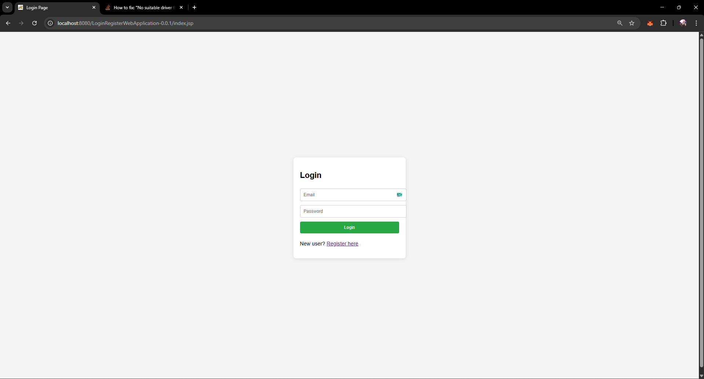
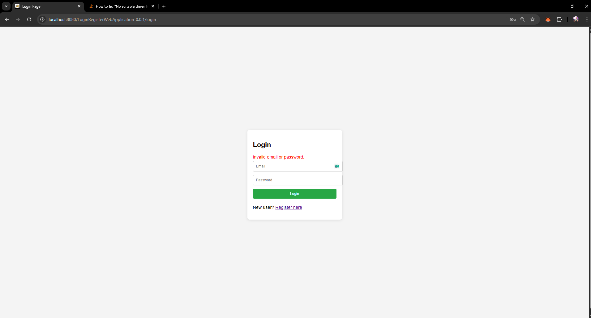
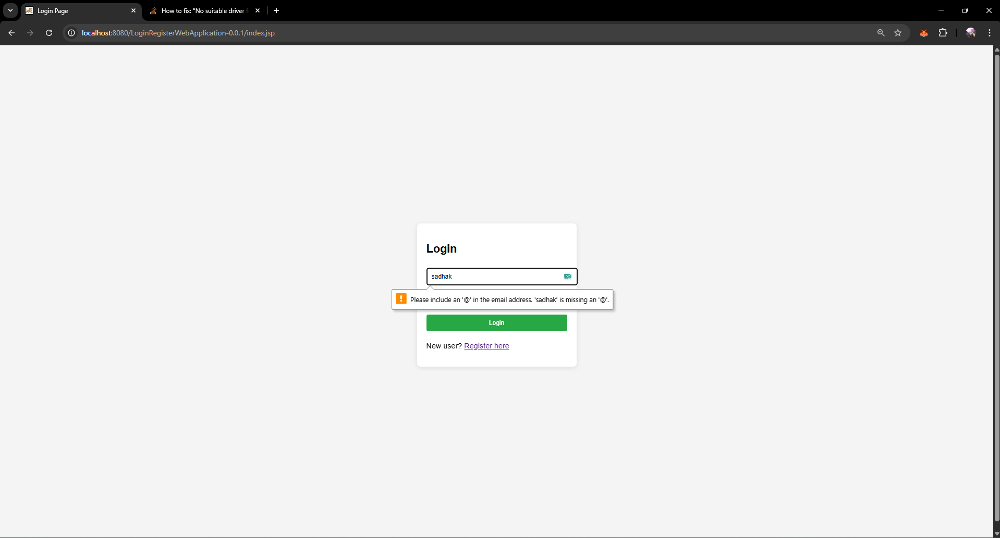
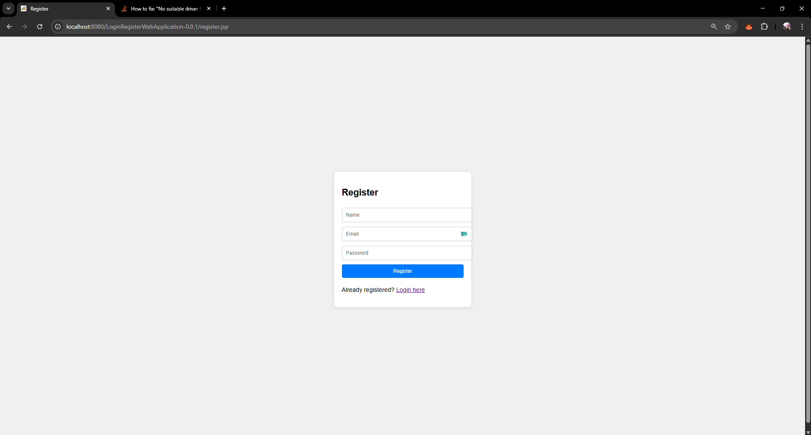
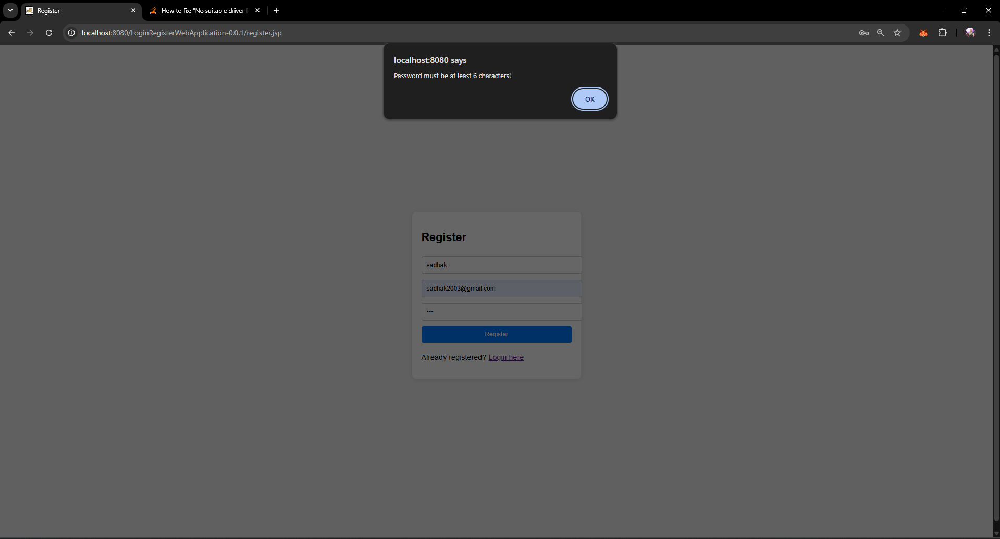
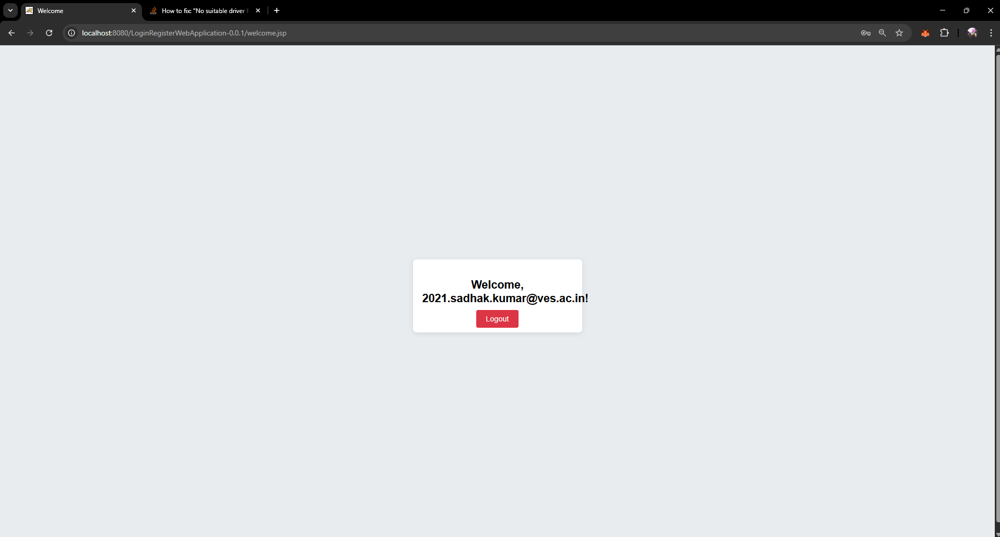
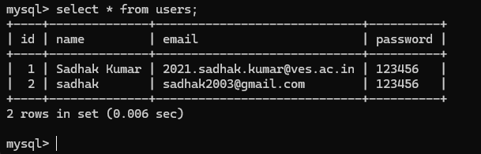

#  LoginRegisterWebApp

A Java EE web application using **Servlets**, **JSP**, **MySQL**, and **Maven**. This project demonstrates core web development concepts like **user registration**, **login**, **session management**, and **database connectivity** using **JDBC**.

---

## Features

- ✅ User Registration (name, email, password)
- ✅ Login with session handling
- ✅ Logout functionality
- ✅ Session-based access to protected pages (`welcome.jsp`)
- ✅ Client-side form validation using JavaScript
- ✅ Server-side input handling with Servlet validation
- ✅ JDBC-based MySQL integration
- ✅ Organized Maven folder structure
- ✅ Clean user interface using HTML & CSS

---

## 🗂️ Folder Structure (Maven-Based)

```plaintext
LoginRegisterWebApp/
│
├── src/
│   └── main/
│       ├── java/
│       │   └── com/
│       │       └── sadhak/
│       │           ├── corejava/
│       │           │   └── jdbc/
│       │           │       └── DBConnection.java        # Manages DB connection via JDBC
│       │           └── servlet/
│       │               ├── LoginServlet.java            # Handles login logic
│       │               ├── RegisterServlet.java         # Handles user registration
│       │               └── LogoutServlet.java           # Manages logout and session invalidation
│       ├── webapp/
│       │   ├── index.jsp                                # Login form
│       │   ├── register.jsp                             # Registration form
│       │   ├── welcome.jsp                              # Protected welcome page
│       │   ├── js/
│       │   │   └── validation.js                        # Client-side input validation
│       │   └── WEB-INF/
│       │       └── web.xml                              # Optional servlet configuration
│
├── pom.xml                                              # Maven configuration file
└── README.md                                            # Project documentation
```

---

## ⚙️ How It Works

### 🧩 Servlet Logic

- **LoginServlet.java**
  - Retrieves email & password from the form
  - Checks credentials against the `users` table
  - If matched, stores the user in session and redirects to `welcome.jsp`

- **RegisterServlet.java**
  - Validates and inserts new user data into the `users` table
  - Prevents duplicate registration using unique email constraint

- **LogoutServlet.java**
  - Invalidates the user session and redirects to the login page


---

### 🖼️ JSP Pages

- **index.jsp**
  - Login form with client-side validation

  ### Login page
  

  ### Login with Invalid Credentials
  

  ### Login with javascript Validation
  
- **register.jsp**
  - Registration form

  ### Registration page
  

### Registration page with validation
  
- **welcome.jsp**
  - Protected page shown only after successful login
  - Uses session to show the logged-in user's name
  - Provides logout link

    ### Welcome page with logout function
  

---

## 💾 MySQL Setup

### Database & Table

```sql
CREATE DATABASE UserLogin;

USE UserLogin;

CREATE TABLE users (
    id INT AUTO_INCREMENT PRIMARY KEY,
    name VARCHAR(100) NOT NULL,
    email VARCHAR(100) NOT NULL UNIQUE,
    password VARCHAR(100) NOT NULL
);
```

  ### sql 
  

---

## 📦 Maven Dependencies

Add this to your `pom.xml` to include the MySQL JDBC driver:

```xml
<dependencies>
    <dependency>
        <groupId>mysql</groupId>
        <artifactId>mysql-connector-j</artifactId>
        <version>8.3.0</version>
    </dependency>
    <dependency>
      <groupId>jakarta.servlet</groupId>
        <artifactId>jakarta.servlet-api</artifactId>
      <version>5.0.0</version> 
      <scope>provided</scope>
    </dependency>
</dependencies>
```

---

## 🔧 How to Run

1. **Clone the Repository**
   - Clone the repository and move to the ` ClientServerApplication > LoginRegisterWebApplication ` directory

2. **Open in IDE**
   - Use IntelliJ IDEA, Eclipse, or VS Code with Java extensions

3. **Configure Database**
   - Set DB credentials in `DBConnection.java`

4. **Build the Project**
   ```bash
   mvn clean install
   ```

5. **Deploy to Tomcat**
   - Copy the generated `.war` file to your Tomcat `webapps` folder
   - OR deploy directly from IDE

6. **Visit in Browser**
   ```
   http://localhost:8080/LoginRegisterWebApp/
   ```

---

## 🧠 Technologies Used

| Tech         | Purpose                            |
|--------------|------------------------------------|
| Java         | Core programming language          |
| JSP          | Frontend rendering                 |
| Servlets     | Request handling                   |
| MySQL        | Data persistence                   |
| JDBC         | Database connectivity              |
| Maven        | Dependency and project management  |
| Tomcat       | Servlet container                  |
| HTML/CSS/JS  | Frontend UI & validation           |

---
