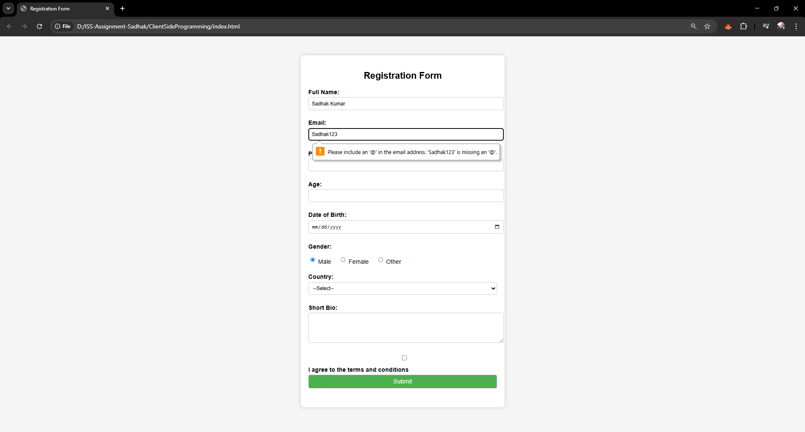
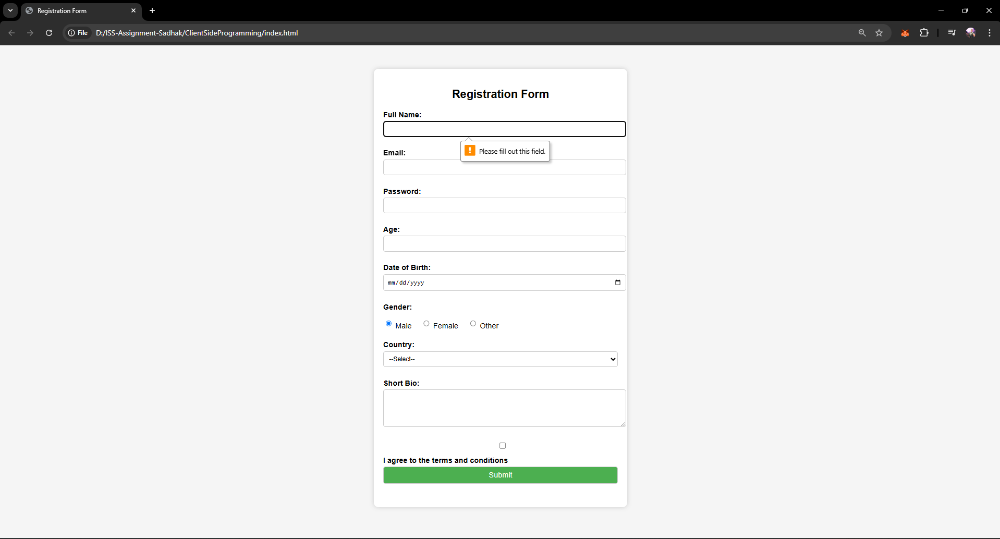
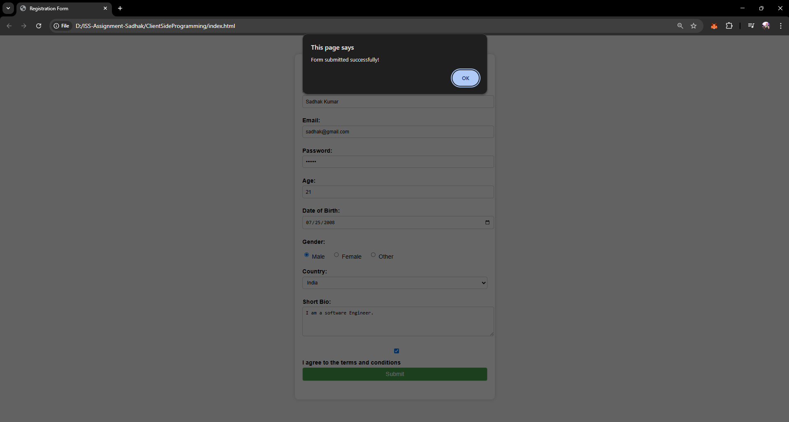

# ClientSideProgramming

This project demonstrates the use of **HTML**, **CSS**, and **JavaScript** to build an interactive registration form with client-side validations. It is part of the ISS Assignment.

## Features

- Responsive registration form using HTML and CSS
- Client-side validation for required fields, email format, password length, and terms agreement using JavaScript
- Clean and semantic HTML structure

## Registration Form Fields

- Full Name (required)
- Email (required, validated format)
- Password (required, minimum 6 characters)
- Age
- Date of Birth
- Gender (required: Male, Female, Other)
- Country (required: India, USA, UK)
- Short Bio
- Terms and Conditions agreement (required)

## Images

### Email Validation

### Form Fields Validation

### Submitting the Form


## Getting Started

1. Clone or download this repository.
2. Navigate to the `ClientSideProgramming` folder.
3. Open `index.html` in your web browser.

## Folder Structure

```
ClientSideProgramming/
├── index.html
├── styles.css
└── script.js
```

## Usage

- Modify `index.html` to change the form structure.
- Edit `styles.css` for custom styles.
- Update `script.js` to adjust or add validation logic.
