# Core Java Project

This repository contains a collection of core Java programs, demonstrating fundamental concepts and features of the Java programming language. Each class is designed to showcase a specific topic or functionality, making this project a great resource for learning and reference.

## Project Structure

```
CoreJava/
├── assets/                # Screenshots and images of program execution
└── src/
    └── com/
        └── sadhak/
            └── corejava/
                ├── 1st Folder for 1st concept
                ├── 2nd Folder for 2nd concept
                ├── ...
```

- **src/com/sadhak/corejava/**: Contains all Java source files, each representing a different concept or example.
- **assets/**: Contains images showing the output or execution of each class.

## Output Screenshots

### Basic of java
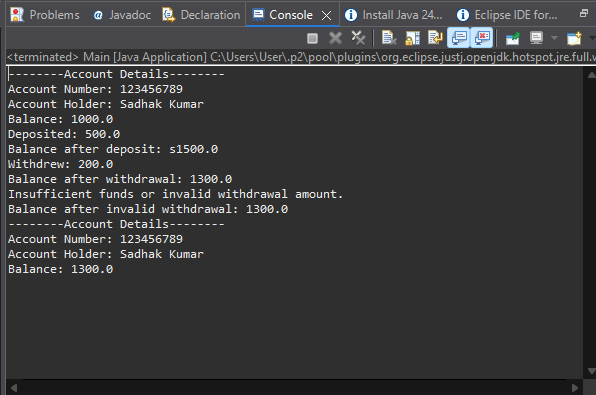

### Basic Datatypes
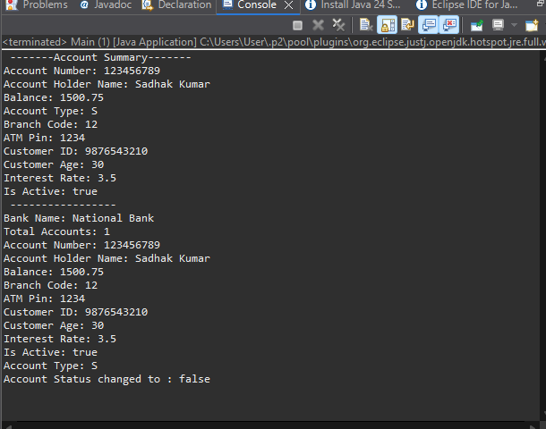

### Loop Control
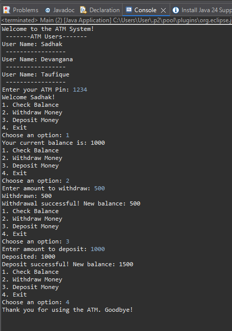

### Strings and Arrays
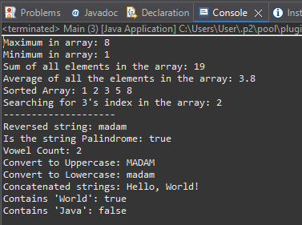

### OOPS Concepts
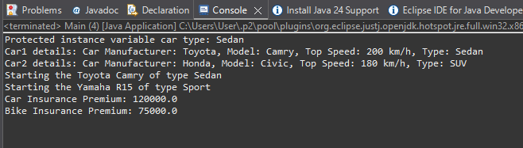

### Collection Operations
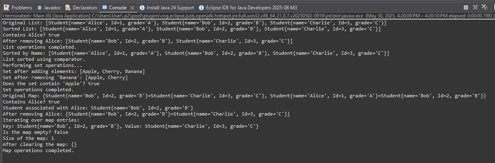

### Multithreading Concepts
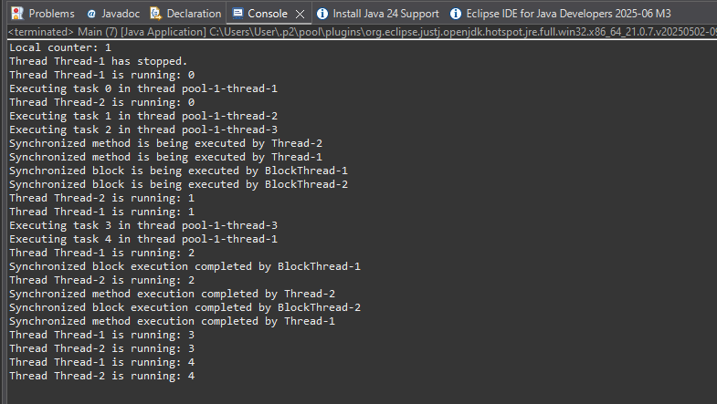

### JSON Handling
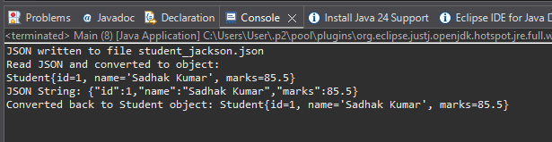

### XML Parsing
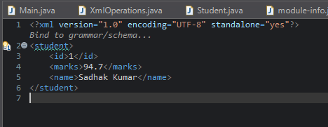

### File operations
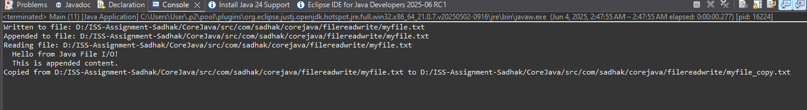
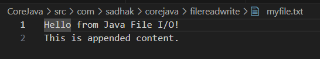

### JDBC
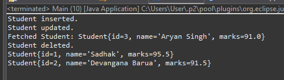
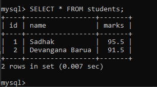
