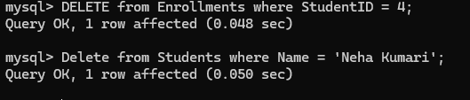

# 📚 SQL Practice: Basic Queries Using CollegeDB

This document contains SQL commands with explanations for creating a sample database, inserting records, and executing basic queries listed in your DBMS syllabus.

---

## 1. Create Database

First, we create the database `CollegeDB` and select it for use.

```sql
CREATE DATABASE CollegeDB;
USE CollegeDB;
```


---

## 2. Create Tables

We create three tables: `Students`, `Courses`, and `Enrollments` with appropriate constraints.

```sql
-- Students Table
CREATE TABLE Students (
    StudentID INT AUTO_INCREMENT PRIMARY KEY,
    Name VARCHAR(100) NOT NULL,
    Age INT,
    Gender VARCHAR(10),
    Email VARCHAR(100) UNIQUE
);

-- Courses Table
CREATE TABLE Courses (
    CourseID INT AUTO_INCREMENT PRIMARY KEY,
    CourseName VARCHAR(100),
    Instructor VARCHAR(100)
);

-- Enrollments Table (Join Table)
CREATE TABLE Enrollments (
    EnrollmentID INT AUTO_INCREMENT PRIMARY KEY,
    StudentID INT,
    CourseID INT,
    FOREIGN KEY (StudentID) REFERENCES Students(StudentID),
    FOREIGN KEY (CourseID) REFERENCES Courses(CourseID)
);
```


---

## 3. Insert Sample Data

We add a few entries into each table to test the queries.

```sql
-- Students
INSERT INTO Students (Name, Age, Gender, Email)
VALUES
('Aryan Mehta', 19, 'Male', 'aryan@gmail.com'),
('Sanya Singh', 21, 'Female', 'sanya@example.com'),
('Rahul Das', 20, 'Male', NULL),
('Neha Kumari', 18, 'Female', 'neha18@college.com');

-- Courses
INSERT INTO Courses (CourseName, Instructor)
VALUES
('DBMS', 'Dr. Sharma'),
('Operating Systems', 'Prof. Iyer'),
('Web Development', 'Ms. Rao');

-- Enrollments
INSERT INTO Enrollments (StudentID, CourseID)
VALUES
(1, 1), (2, 1), (2, 3), (3, 2), (4, 3);
```


---

## 4. Basic Queries

### SELECT, DISTINCT

Used to retrieve records and unique column values.

```sql
SELECT * FROM Students;
SELECT DISTINCT Gender FROM Students;
```


### WHERE, AND & OR

Used to filter records based on conditions.

```sql
SELECT * FROM Students WHERE Age > 18;
SELECT * FROM Students WHERE Age > 18 AND Gender = 'Male';
SELECT * FROM Students WHERE Age < 21 OR Gender = 'Female';
```


### ORDER BY

Sorts the result by one or more columns.

```sql
SELECT * FROM Students ORDER BY Name ASC;
SELECT * FROM Students ORDER BY Age DESC;
```


### UPDATE

Modifies existing data.

```sql
UPDATE Students SET Age = 22 WHERE Name = 'Sanya Singh';
```


### DELETE

Deletes a row of data.

```sql
DELETE FROM Students WHERE Name = 'Kunal Raj';
```



### SQL Injection (Example — Not to Use in Real Apps)

Demonstrates how insecure queries can be exploited.

```sql
SELECT * FROM Students WHERE Name = '' OR '1'='1';
```


### SELECT TOP / LIMIT

Limits the number of rows in the result.

```sql
SELECT * FROM Students LIMIT 2;
```


### LIKE and WILDCARDS

Used for pattern matching.

```sql
SELECT * FROM Students WHERE Name LIKE 'A%';
SELECT * FROM Students WHERE Email LIKE '%@college.com';
```


### IN, BETWEEN

Filters values within a specific set or range.

```sql
SELECT * FROM Students WHERE Age IN (18, 20, 22);
SELECT * FROM Students WHERE Age BETWEEN 18 AND 21;
```


### ALIASES

Renames columns or tables for readability.

```sql
SELECT Name AS StudentName, Email AS ContactEmail FROM Students;
```


---

This covers all basic SQL operations.
