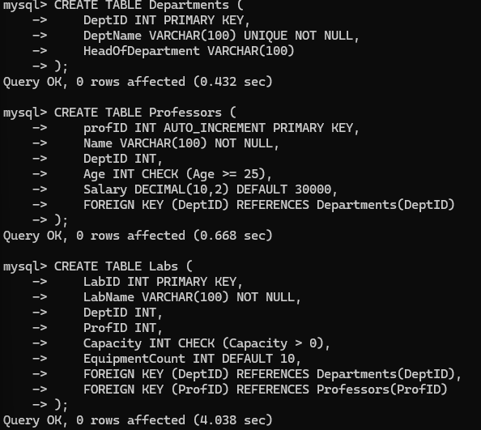

# SQL Tables with Constraints and Relationships

This document describes three related SQL tables—`Departments`, `Professors`, and `Labs`—used to demonstrate **Primary Key**, **Foreign Key**, **Check**, **Default**, and **Indexing** concepts.

---

## Table: Departments

```sql
CREATE TABLE Departments (
    DeptID INT PRIMARY KEY,
    DeptName VARCHAR(100) UNIQUE NOT NULL,
    HeadOfDepartment VARCHAR(100)
);
```

### Explanation:

- `DeptID`: Primary Key
- `DeptName`: Must be unique and not null
- Holds department-level information

---

## Table: Professors

```sql
CREATE TABLE Professors (
    ProfID INT PRIMARY KEY,
    Name VARCHAR(100) NOT NULL,
    DeptID INT,
    Age INT CHECK (Age >= 25),
    Salary DECIMAL(10, 2) DEFAULT 30000,
    FOREIGN KEY (DeptID) REFERENCES Departments(DeptID)
);
```

### Explanation:

- `ProfID`: Primary Key
- `DeptID`: Foreign Key linked to `Departments`
- `Age`: Must be 25 or above (Check constraint)
- `Salary`: Defaults to 30000 if not provided

---

## Table: Labs

```sql
CREATE TABLE Labs (
    LabID INT PRIMARY KEY,
    LabName VARCHAR(100) NOT NULL,
    DeptID INT,
    ProfID INT,
    Capacity INT CHECK (Capacity > 0),
    EquipmentCount INT DEFAULT 10,
    FOREIGN KEY (DeptID) REFERENCES Departments(DeptID),
    FOREIGN KEY (ProfID) REFERENCES Professors(ProfID)
);
```

### Explanation:

- `LabID`: Primary Key
- `DeptID` & `ProfID`: Foreign Keys to `Departments` and `Professors`
- `Capacity`: Must be greater than 0
- `EquipmentCount`: Defaults to 10



---

## Index

```sql
CREATE INDEX idx_lab_name
ON Labs(LabName);
```

This index speeds up search queries for labs by name.


---

# Testing the constraints

## Trying duplicate insertion

```sql
-- First insert
INSERT INTO Departments (DeptID, DeptName, HeadOfDepartment)
VALUES (1, 'Computer Science', 'Dr. Sharma');


INSERT INTO Departments (DeptID, DeptName, HeadOfDepartment)
VALUES (1, 'Information Technology', 'Dr. Verma');
-- This will fail due to duplicate DeptID

```


# Testing Unique Constraint

## Inserting duplicate value

```sql
INSERT INTO Departments (DeptID, DeptName, HeadOfDepartment)
VALUES (2, 'Computer Science', 'Dr. Sinha');
```


# Testing NOT NULL Constraint

## Insert NULL into DeptName which is NOT NULL

```sql
INSERT INTO Departments (DeptID, DeptName, HeadOfDepartment)
VALUES (3, NULL, 'Dr. Mehta');
```


# Foreign Key Constraint

## Insert into Professors with non-existent DeptID sql Copy Edit

```sql
INSERT INTO Professors (ProfID, Name, DeptID, Age)
VALUES (101, 'Dr. Patel', 999, 40);

```


## Check Constraint

## Violate Age >= 25 in Professors

```sql
INSERT INTO Professors (ProfID, Name, DeptID, Age)
VALUES (102, 'Dr. Nair', 1, 22);
```


# Default Values

## Omit Salary to test default in Professors

```sql
INSERT INTO Professors (ProfID, Name, DeptID, Age)
VALUES (103, 'Dr. Rao', 1, 45);
```


# Indexing

## Testing the index

```sql
EXPLAIN SELECT * FROM Labs WHERE LabName = 'Robotics Lab';
```


This would work well when there are many records stored in the table
