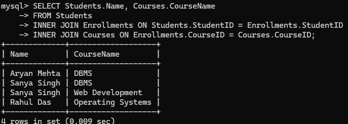
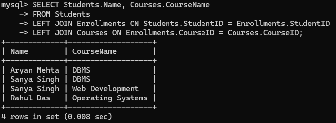
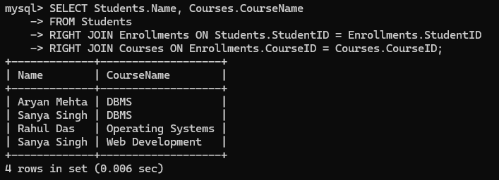
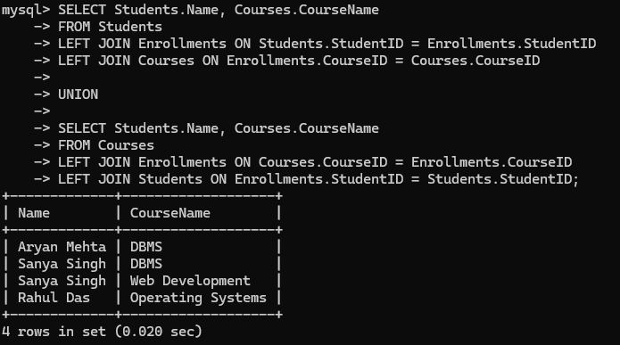

# 🔗 SQL JOINS Explained with Examples (CollegeDB)

This document covers all types of SQL joins using a sample college database with **Students**, **Courses**, and **Enrollments** tables.

---

## Table Overview

| Table         | Description                              |
| ------------- | ---------------------------------------- |
| `Students`    | Holds student information                |
| `Courses`     | Holds course information                 |
| `Enrollments` | Links students to courses (many-to-many) |

---

## 1. INNER JOIN

**Returns rows when there is a match in both joined tables.**

```sql
SELECT Students.Name, Courses.CourseName
FROM Students
INNER JOIN Enrollments ON Students.StudentID = Enrollments.StudentID
INNER JOIN Courses ON Enrollments.CourseID = Courses.CourseID;
```

_Shows only students who are enrolled in courses._



---

## 2. LEFT JOIN

**Returns all rows from the left table (Students), with matching rows from the right table (Courses). NULLs are returned if there's no match.**

```sql
SELECT Students.Name, Courses.CourseName
FROM Students
LEFT JOIN Enrollments ON Students.StudentID = Enrollments.StudentID
LEFT JOIN Courses ON Enrollments.CourseID = Courses.CourseID;
```

_Includes all students, even those not enrolled in any course._



---

## 3. RIGHT JOIN

**Returns all rows from the right table (Courses), with matching rows from the left table (Students). NULLs are returned if there's no match.**

```sql
SELECT Students.Name, Courses.CourseName
FROM Students
RIGHT JOIN Enrollments ON Students.StudentID = Enrollments.StudentID
RIGHT JOIN Courses ON Enrollments.CourseID = Courses.CourseID;
```

_Includes all courses, even those without any enrolled students._



---

## 4. FULL OUTER JOIN (Simulated in MySQL)

**Combines results of both LEFT and RIGHT JOINs. Includes all rows from both tables.**

```sql
SELECT Students.Name, Courses.CourseName
FROM Students
LEFT JOIN Enrollments ON Students.StudentID = Enrollments.StudentID
LEFT JOIN Courses ON Enrollments.CourseID = Courses.CourseID

UNION

SELECT Students.Name, Courses.CourseName
FROM Courses
LEFT JOIN Enrollments ON Courses.CourseID = Enrollments.CourseID
LEFT JOIN Students ON Enrollments.StudentID = Students.StudentID;
```

_Shows all students and courses — even if there is no match between them._



---
