# Advanced SQL Queries with Constraints and Functions

### This document contains SQL queries demonstrating advanced concepts such as DROP, ALTER, AUTO INCREMENT, VIEWS, handling NULL values, GROUP BY, HAVING, and NULL functions.

# DROP Table

## Used to delete a table

```sql
CREATE TABLE TestTable(TestID INT PRIMARY KEY);

drop table TestTable;
```

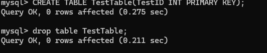

# Alter Table

## Adding a new column

```sql
ALTER TABLE Professors
ADD Email VARCHAR(100);

select * from Professors;
```

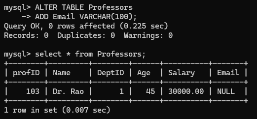

# Modify a column

## Change the datatype of a column

```sql
ALTER TABLE Departments
MODIFY DeptName VARCHAR(150);

Desc Departments;
```

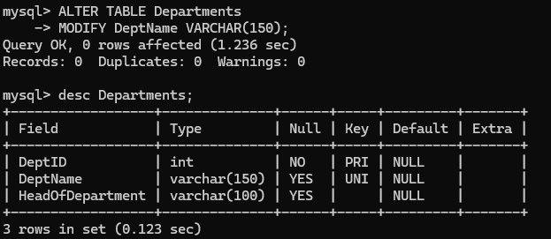

# View

## View for professors with high salary

```sql
CREATE VIEW HighPaidProfessors AS
SELECT Name, Salary FROM Professors
WHERE Salary > 40000;
```

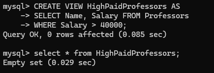

# Null value

## Insert Null Value

```sql
INSERT INTO Departments (DeptID, DeptName, HeadOfDepartment)
VALUES (10, 'Civil', NULL);
```

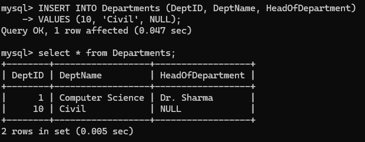

## Query Null value

```sql
SELECT * FROM Departments
WHERE HeadOfDepartment IS NULL;
```

# Group By

```sql
SELECT DeptID, COUNT(*) AS TotalProfessors
FROM Professors
GROUP BY DeptID;
```

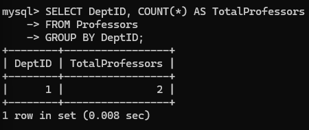

# Having

```sql
SELECT DeptID, AVG(Salary) AS AvgSalary
FROM Professors
GROUP BY DeptID
HAVING AVG(Salary) > 20000;
```

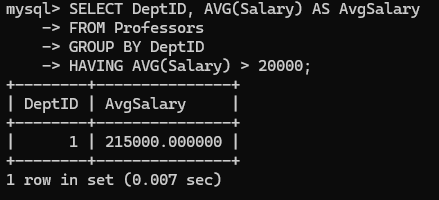

# Null Functions

```sql
SELECT Name, IFNULL(Email, 'No Email') AS EmailStatus FROM Professors;
```

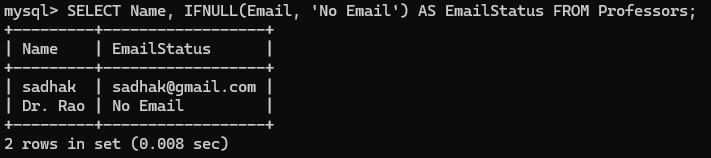

# Prepared Statement

```sql
PREPARE stmt FROM 'SELECT * FROM Professors WHERE DeptID = ?';
SET @dept = 1;
EXECUTE stmt USING @dept;
```

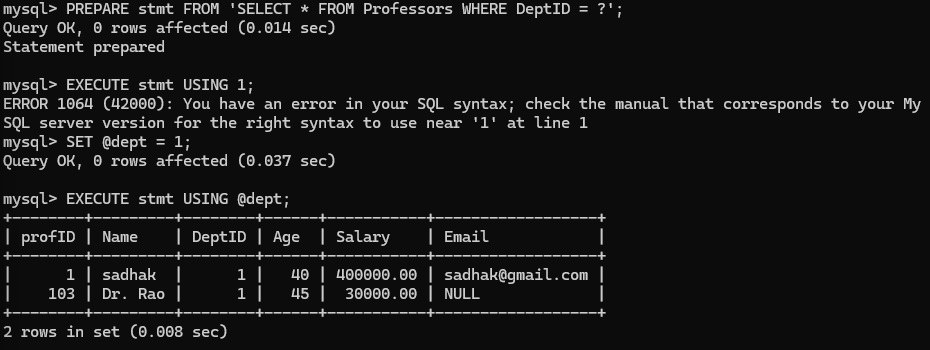

# Stored Procedure

## Create stored procedure to get professors with salary > 25000:

```sql
DELIMITER //
CREATE PROCEDURE GetHighPaidProfessors()
BEGIN
    SELECT * FROM Professors WHERE Salary > 25000;
END //
DELIMITER ;

CALL GetHighPaidProfessors() //
```

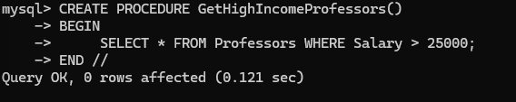

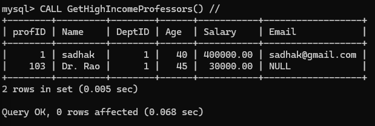
