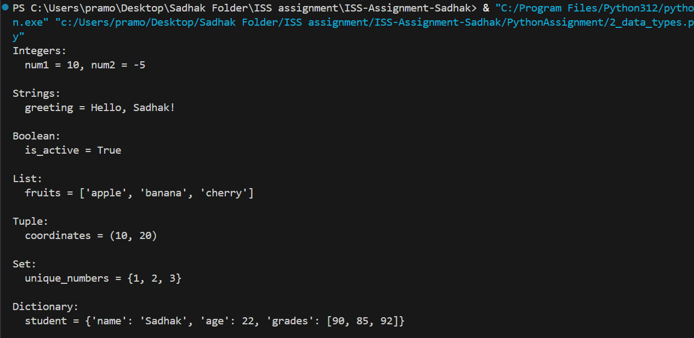

# Python Pre-Joining Training

# Tasks Completed

## 1. Variables & Constants  

## 2. Data Types (Integers, Strings, Booleans, Lists, Tuples,Sets, Dictionaries)
   
## 3. Type Conversion (Implicit & Explicit)
  
## 4. Control Flow (if-else, loops, break, continue, pass, loop-else)  

## 5. Functions (Parameters, Return, *args, **kwargs)
  
## 6. Error Handling (try-except, else-finally, raise)
